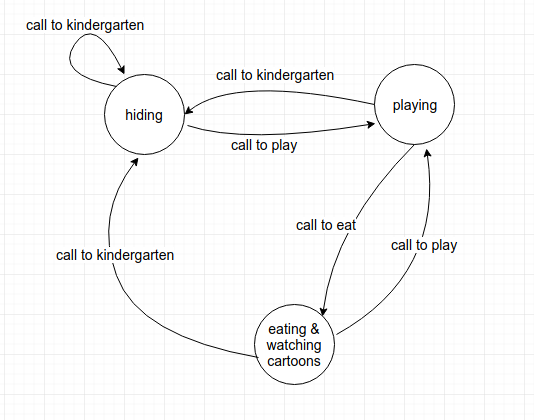

# Simplified state machine of a 4-year-old child

Build a dockerized Elixir application using Phoenix and LiveView. (Dev env is enough)

It should start up with `docker-compose up` and be reachable at http://localhost:4000.

At http://localhost:4000 the application should mount a LiveView that displays the state of the state machine process that we describe below.

## The State machine process
The application starts a GenServer that acts as a state machine based on the diagram below.

The initial state is playing.

Opening the application in the browser displays a page with the current state of the state machine.
There are buttons on the page to trigger the events that change the state of the state machine.

## Constraints
* Only use simple GenServer for the state machine process (no GenStateMachine or similar)
* The current state of the state machine is always displayed on the page.
* Impossible transitions should not change state but print a msg similar to: "Cannot transition from [current state] with [call]"

## Clarification
The state machine process is separate from the LiveView process that displays the state of the state machine in the browser.

## Bonus
Child has two new properties:
* mood - int (initial: 0)
* snacks - int (initial: 0)

Snacks can be given to the child only when he is in the playing or eating state.

Snacks are consumed before the child transitions from the eating state to the playing state.

Snacks raise the mood when consumed:
* every third snack raises it by 2
* every fifth snack raises it by 4
* every fifteenth snack raises it by 8
* every other snack raises it by 1

mood falls back to 0 when state transitions to hiding
